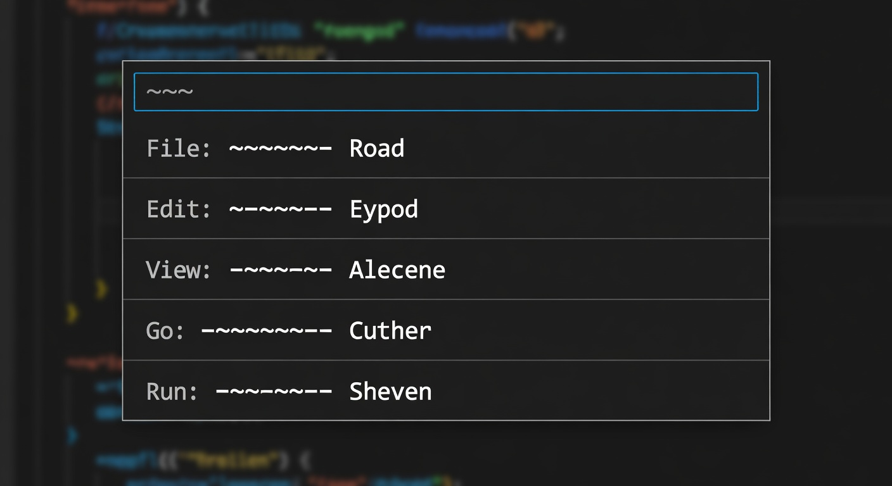
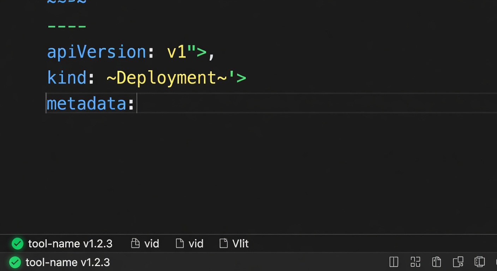

<p align="center">
  
</p>

# Patchloom for VS Code

[](https://github.com/patchloom/patchloom-vscode/actions/workflows/ci.yml)

The official VS Code extension for [Patchloom](https://github.com/patchloom/patchloom). Set up your workspace for AI agent workflows in seconds: detect the CLI, generate agent rules, configure MCP servers, and run structured file operations from the command palette.

---

## Get started in 30 seconds

1. Install the [Patchloom CLI](https://github.com/patchloom/patchloom/releases)
2. Install this extension
3. Open a project and run **Patchloom: Setup Workspace**

The extension finds the CLI automatically. If it's not on `PATH`, point `patchloom.path` to it in settings.

---

## Features

### One-click workspace setup

Run `Patchloom: Setup Workspace` to walk through everything your project needs: binary detection, `AGENTS.md` generation, and MCP server configuration.

### Agent rules generation

<p align="center">
  
</p>

`Patchloom: Initialize Project` generates an `AGENTS.md` file from `patchloom agent-rules`. If one already exists, the extension opens a diff so you can merge updates manually.

### MCP server configuration

`Patchloom: Configure MCP` injects the Patchloom MCP server into your editor's config. Supports:

- **VS Code** (`.vscode/mcp.json`)
- **Cursor** (`.cursor/mcp.json`)
- **Windsurf** (`~/.codeium/windsurf/mcp_config.json`)

### Status bar

<p align="center">
  
</p>

The status bar shows binary readiness and CLI version at a glance. Click it to see full diagnostics.

### Quick actions

`Patchloom: Quick Action` builds common CLI commands (replace, tidy, doc set) from an interactive picker. Select the operation, pick a target file, and the extension assembles the command with a diff preview before applying.

### Compatibility diagnostics

The extension detects outdated CLI builds and warns with upgrade guidance. It requires Patchloom `0.1.0` or newer.

---

## Commands

| Command | Description |
|---------|-------------|
| `Patchloom: Setup Workspace` | Guided walkthrough for binary, AGENTS.md, and MCP readiness |
| `Patchloom: Initialize Project` | Generate or diff `AGENTS.md` from `patchloom agent-rules` |
| `Patchloom: Configure MCP` | Inject Patchloom MCP server config into editor config files |
| `Patchloom: Quick Action` | Build a Patchloom CLI command from an interactive picker |
| `Patchloom: Show Status` | Display binary readiness, version, compatibility, and workspace state |
| `Patchloom: Open Settings` | Jump to Patchloom extension settings |
| `Patchloom: Open Releases` | Open the Patchloom releases page in a browser |

## Settings

| Setting | Default | Description |
|---------|---------|-------------|
| `patchloom.path` | `""` | Absolute path to the Patchloom binary. When empty, the extension searches `PATH` and then the managed install location. |
| `patchloom.showStatusBar` | `true` | Show a status bar item reporting whether Patchloom is available. |

---

## Remote and multi-root workspaces

- In multi-root workspaces, commands target the active editor's workspace folder. If no editor is active, you pick the folder.
- Remote sessions (WSL, SSH, dev containers, Codespaces) stay focused on workspace-scoped flows. User-scoped MCP config targets are hidden in remote environments.
- Unknown remote environments are surfaced as unverified so failures are explicit.

---

## Troubleshooting

**Patchloom not found**
Set `patchloom.path` in settings, or add the CLI to your `PATH`.

**CLI compatibility warning**
Run `Patchloom: Open Releases` to download `0.1.0` or newer.

**MCP config not injected**
Run `Patchloom: Configure MCP` and select the target editor config.

**Managed install failure persists after restart**
Run `Patchloom: Show Status` to see persisted diagnostic details.

---

## Security model

The managed installer work is intentionally conservative:

- Downloads must come from `https://github.com/patchloom/patchloom/releases/download/...`
- Each archive must match a published SHA-256 checksum before the extension trusts it
- Checksum failures stop the install before any managed binary is used
- A failed install never replaces an already working binary
- Binary promotion creates a backup before swapping; failures restore the backup
- Failure records persist across extension reloads for diagnostics

---

## Reporting issues

File bugs and feature requests at [patchloom/patchloom-vscode/issues](https://github.com/patchloom/patchloom-vscode/issues). Include the output of `Patchloom: Show Status` and your VS Code version.

---

## Contributing

```bash
npm install
npm run compile
npm test
```

Open the repo in VS Code and press `F5` to launch the Extension Development Host.

Package with `npm run package` (creates a `.vsix` using `@vscode/vsce`).
