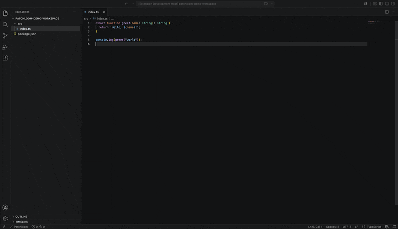

<p align="center">
  
</p>

# Patchloom for VS Code

[](https://github.com/patchloom/patchloom-vscode/actions/workflows/ci.yml)
[](https://github.com/patchloom/patchloom-vscode/actions/workflows/security.yml)
[](https://github.com/patchloom/patchloom-vscode/actions/workflows/ci.yml)
[](https://marketplace.visualstudio.com/items?itemName=patchloom.patchloom)
[](https://open-vsx.org/extension/patchloom/patchloom)
[](https://securityscorecards.dev/viewer/?uri=github.com/patchloom/patchloom-vscode)
[](https://www.bestpractices.dev/projects/13100)
[](https://github.com/patchloom/patchloom-vscode/blob/main/LICENSE)

The official VS Code extension for [Patchloom](https://github.com/patchloom/patchloom). Set up your workspace for AI agent workflows in seconds: detect the CLI, generate agent rules, configure MCP servers, and run structured file operations from the command palette.

---

## Install

Install from the [VS Code Marketplace](https://marketplace.visualstudio.com/items?itemName=patchloom.patchloom) or the [Open VSX Registry](https://open-vsx.org/extension/patchloom/patchloom).

Or search for **Patchloom** in the Extensions view (`Ctrl+Shift+X` / `Cmd+Shift+X`).

## Get started in 30 seconds

1. Install the [Patchloom CLI](https://github.com/patchloom/patchloom) (or run **Patchloom: Install Patchloom** from the command palette)
   ```sh
   brew install patchloom/tap/patchloom          # macOS / Linux (Homebrew)
   curl -LsSf https://github.com/patchloom/patchloom/releases/latest/download/patchloom-installer.sh | sh  # shell script
   cargo install patchloom                        # from source
   ```
2. Open a project and run **Patchloom: Setup Workspace**

<p align="center">
  
</p>

The extension finds the CLI automatically. If it's not on `PATH`, point `patchloom.path` to it in settings.

---

## Features

### One-click workspace setup

Run `Patchloom: Setup Workspace` to walk through everything your project needs: binary detection, `AGENTS.md` generation, and MCP server configuration.

### Agent rules generation

`Patchloom: Initialize Project` generates an `AGENTS.md` file from `patchloom agent-rules`. If one already exists, the extension opens a diff so you can merge updates manually.

### MCP server configuration

`Patchloom: Configure MCP` injects the Patchloom MCP server into your editor's config. Supports:

- **VS Code** (`.vscode/mcp.json`)
- **Cursor** (`.cursor/mcp.json`)
- **Windsurf** (`~/.codeium/windsurf/mcp_config.json`)

### Status bar

The status bar shows MCP and binary readiness at a glance:

- **$(plug) Patchloom MCP** when the MCP server is configured
- **$(check) Patchloom** when the binary is ready but MCP is not yet set up
- **$(warning) Patchloom** when the binary is missing or needs an upgrade

Click it to see full diagnostics, including per-editor MCP configuration status (VS Code, Cursor, Windsurf).

### Verify MCP Server

`Patchloom: Verify MCP Server` spawns `patchloom mcp-server`, sends a JSON-RPC `initialize` handshake, and confirms the server responds correctly. Reports the server name and version on success, or a diagnostic error on failure.

### Quick actions

`Patchloom: Quick Action` opens an interactive picker with structured editing operations:

| Action | What it does |
|--------|-------------|
| **Replace text** | Literal text replacement with diff preview before applying |
| **Tidy file** | Whitespace and newline cleanup with diff preview |
| **Set structured value** | Update a JSON, YAML, or TOML key with diff preview |
| **Search text** | Find pattern matches across workspace files (results in output channel) |
| **Create file** | Scaffold a new file and open it in the editor |
| **Read structured value** | Read a JSON/YAML/TOML key and copy to clipboard |
| **Merge patch (three-way)** | Apply a stale patch using three-way merge (v0.2.0+) |

### Batch operations

`Patchloom: Batch Apply` opens a line-oriented plan template where you can compose multiple operations (replace, tidy, doc set). The extension pipes the plan to `patchloom batch --apply` so all changes land atomically.

### Output channel

All CLI invocations, arguments, and output are logged to the **Patchloom** output channel. Run `Patchloom: Show Output` to open it. Useful for debugging and copying full error messages for bug reports.

### Compatibility diagnostics

The extension detects outdated CLI builds and warns with upgrade guidance. It requires Patchloom `0.1.0` or newer.

---

## Commands

| Command | Description |
|---------|-------------|
| `Patchloom: Setup Workspace` | Guided walkthrough for binary, AGENTS.md, and MCP readiness |
| `Patchloom: Initialize Project` | Generate or diff `AGENTS.md` from `patchloom agent-rules` |
| `Patchloom: Configure MCP` | Inject Patchloom MCP server config into editor config files |
| `Patchloom: Quick Action` | Build a Patchloom CLI command from an interactive picker |
| `Patchloom: Batch Apply` | Open a batch plan and execute all operations atomically |
| `Patchloom: Show Output` | Open the Patchloom output channel for CLI logs and diagnostics |
| `Patchloom: Show Status` | Display binary readiness, version, compatibility, and workspace state |
| `Patchloom: Verify MCP Server` | Spawn the MCP server and verify it responds to a JSON-RPC initialize request |
| `Patchloom: Install Patchloom` | Download and install the Patchloom CLI with checksum verification |
| `Patchloom: Update Patchloom` | Update a managed Patchloom install to the latest release |
| `Patchloom: Reinstall Patchloom` | Re-download and reinstall the managed Patchloom binary |
| `Patchloom: Open Settings` | Jump to Patchloom extension settings |
| `Patchloom: Open Releases` | Open the Patchloom releases page in a browser |

## Settings

| Setting | Default | Description |
|---------|---------|-------------|
| `patchloom.path` | `""` | Absolute path to the Patchloom binary. When empty, the extension searches `PATH` and then the managed install location. |
| `patchloom.showStatusBar` | `true` | Show a status bar item reporting whether Patchloom is available. |

---

## Remote and multi-root workspaces

- In multi-root workspaces, commands target the active editor's workspace folder. If no editor is active, you pick the folder.
- Remote sessions (WSL, SSH, dev containers, Codespaces) stay focused on workspace-scoped flows. User-scoped MCP config targets are hidden in remote environments.
- Unknown remote environments are surfaced as unverified so failures are explicit.

---

## Troubleshooting

**Patchloom not found**
Set `patchloom.path` in settings, or add the CLI to your `PATH`.

**CLI compatibility warning**
Run `Patchloom: Open Releases` to download the latest release. The extension requires 0.1.0 or newer; 0.2.0 is recommended.

**MCP config not injected**
Run `Patchloom: Configure MCP` and select the target editor config.

**Managed install failure persists after restart**
Run `Patchloom: Show Status` to see persisted diagnostic details.

**Debugging CLI errors**
Run `Patchloom: Show Output` to see full CLI invocations, arguments, stdout, and stderr in the output channel.

---

## Security model

The managed installer work is intentionally conservative:

- Downloads must come from `https://github.com/patchloom/patchloom/releases/download/...`
- Each archive must match a published SHA-256 checksum before the extension trusts it
- Checksum failures stop the install before any managed binary is used
- A failed install never replaces an already working binary
- Binary promotion creates a backup before swapping; failures restore the backup
- Failure records persist across extension reloads for diagnostics

---

## Reporting issues

File bugs and feature requests at [patchloom/patchloom-vscode/issues](https://github.com/patchloom/patchloom-vscode/issues). Include the output of `Patchloom: Show Status` and your VS Code version.

---

## Requirements

- VS Code 1.90 or newer (or compatible editors: Cursor, Windsurf, VSCodium)
- [Patchloom CLI](https://github.com/patchloom/patchloom) 0.1.0 or newer (0.2.0+ recommended for patch merge and strict transactions)

## Contributing

See [CONTRIBUTING.md](CONTRIBUTING.md) for the full guide. Quick start:

```bash
npm install
npm run check          # full gate: compile + test + package
```

Open the repo in VS Code and press `F5` to launch the Extension Development Host.
